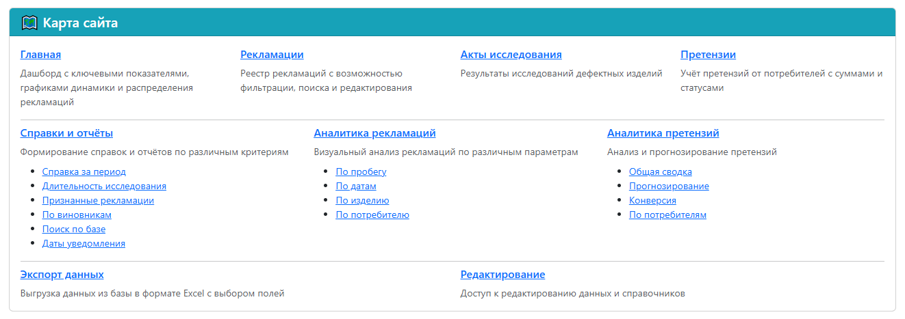
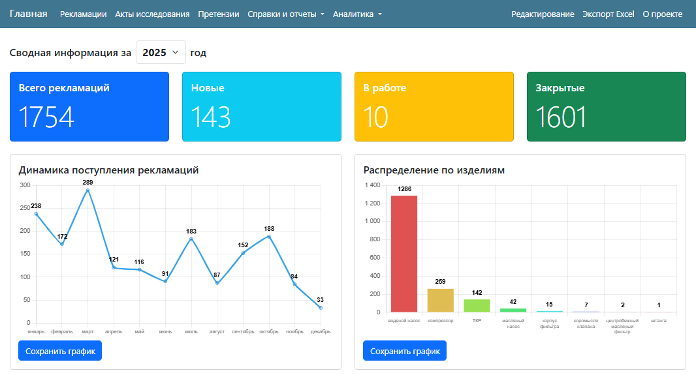
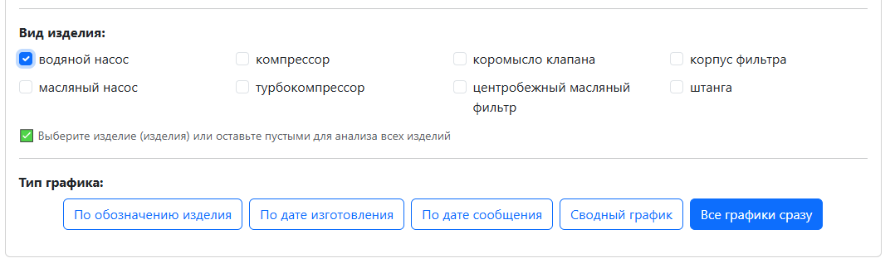
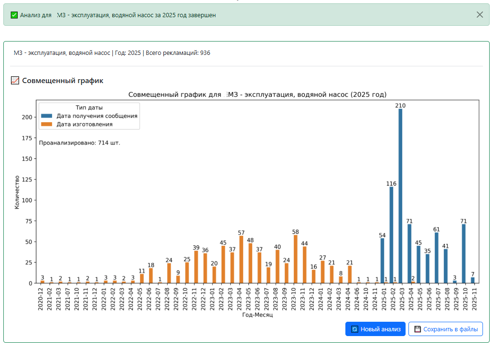
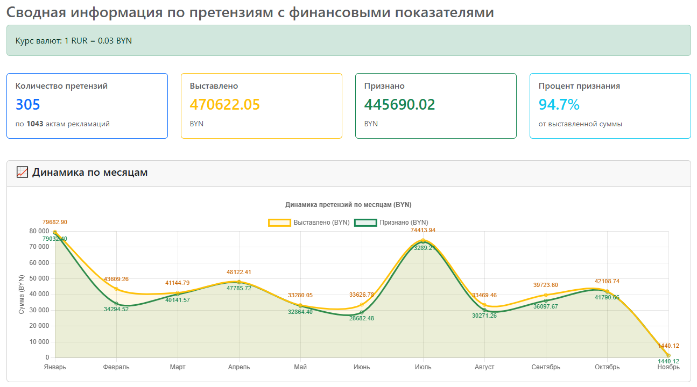
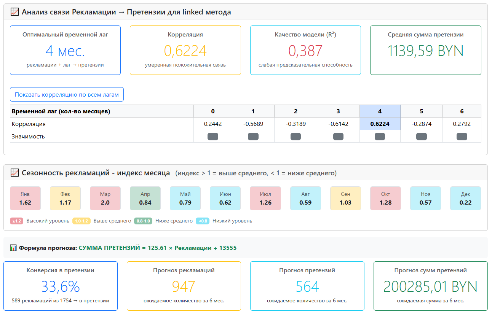
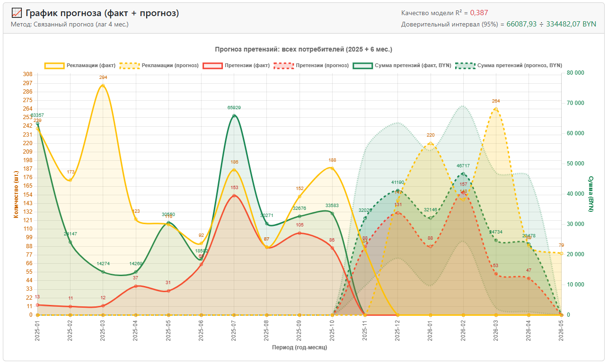
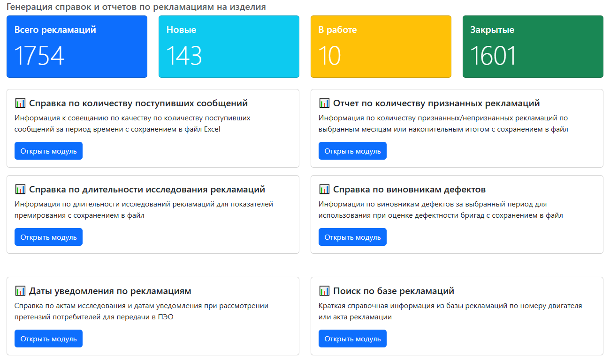
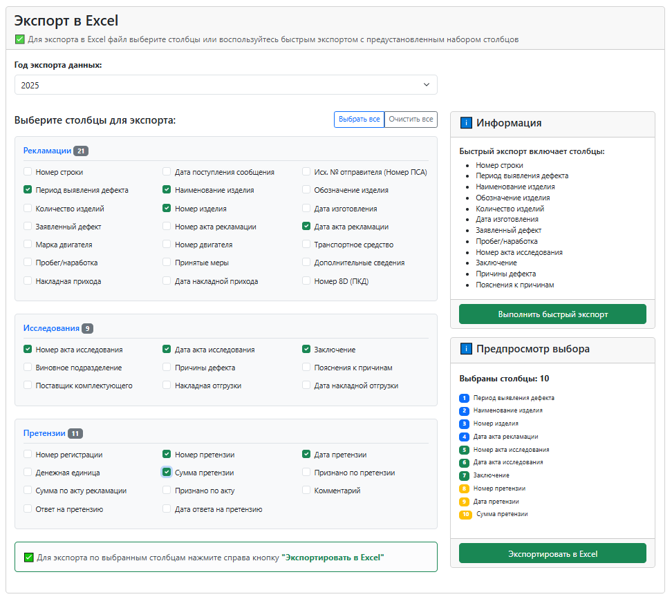

## Аналитическая система управления рекламациями

<div align="center" markdown="1">


### Проект ReclamationHub

[Возможности](#-возможности) •
[Технологии](#-технологии) •
[Архитектура](#-архитектура) •
[Автор](#-автор) •
[Скриншоты](#-скриншоты)

</div>

---

**ReclamationHub** — комплексная система для учёта, анализа и прогнозирования рекламаций и претензий. Разработана для автоматизации работы службы качества предприятия.

### ✅ Ключевые метрики

<div align="center" markdown="1">

| Метрика | Значение |
|---------|----------|
| `Рекламаций в базе`<br>`Пользователей`<br>`Production`<br>`Статус` | 1 800+<br>8<br>С сентября 2025<br>Активно используется |

</div>

### 🔵 Достигнутые результаты

- **Унификация** — единая база данных вместо разрозненных Excel-файлов
- **Автоматизация** — автоматическое формирование отчётов и справок
- **Аналитика** — интерактивные дашборды и визуализация данных
- **Прогнозирование** — ML-модели для предсказания сумм претензий
- **Экономия времени** — значительное сокращение времени на рутинные операции

---

## 📋 `Возможности`

<div align="center" markdown="1">

| Модуль | Функции |
|--------|---------|
| **Учёт и управление** | - Регистрация рекламаций с полным жизненным циклом<br>- Акты исследования дефектных изделий<br>- Учёт претензий с поддержкой нескольких валют<br>- Групповые операции (накладные, акты утилизации) |
| **Аналитика** | - Анализ по пробегу изделий<br>- Анализ по датам изготовления и уведомления<br>- Дефектность по потребителям и изделиям<br>- Интерактивные графики и дашборды |
| **ML-прогнозирование** | - Прогноз сумм претензий на основе исторических данных<br>- Сезонный анализ (12+ месяцев данных)<br>- Корреляционный анализ временных рядов<br>- Анализ конверсии: рекламация → претензия |
| **Отчётность** | - Справка за произвольный период<br>- Длительность исследования рекламаций<br>- Статистика признанных/непризнанных дефектов<br>- Отчёт по виновникам дефектов<br>- Экспорт данных в Excel |

</div>

---

## 📊 `Технологии`

<div align="center" markdown="1">

| Функции | Технология | Назначение |
|---------|------------|------------|
| Backend | `Python 3.11.1`<br>`Django 4.2.20`<br>`MySQL 8.0.32`<br>`Nginx 1.28.0` | Язык программирования<br>Web-фреймворк<br>База данных<br>Reverse proxy, статика |
| Frontend | `Bootstrap 5.3.8`<br>`Chart.js 4.5.0` | UI-фреймворк<br>Интерактивные графики |
| Data Science | `pandas 2.3.1`<br>`scikit-learn 1.7.2`<br>`openpyxl 3.1.5` | Обработка и анализ данных<br>ML-модели прогнозирования<br>Экспорт в Excel |

</div>

---

## 📊 `Архитектура`

```text
reclamationhub/
│
├── analytics/ # Визуальная аналитика
├── claims/ # Претензии + ML-прогнозирование
├── core/ # Метаданные проекта и карта сайта
├── investigations/ # Акты исследований
├── reclamations/ # Основная сущность — рекламации
├── reports/ # Справки и отчёты
├── sourcebook/ # Справочники
└── utils/ # Утилиты (Excel-экспорт)
```

### ✅ Особенности архитектуры

- **Модульность** — разделение на Django-приложения по доменам
- **Fat Modules, Thin Views** — бизнес-логика вынесена в отдельные модули
- **Разделение настроек** — base/development/production
- **Автоматизация** — скрипты бэкапа и уведомлений

### `Карта сайта`


*Рис. 1 — Приложения и модули*

---

## 📊 `Автор`

[Vasilenok Igor](https://github.com/IgorVimbor)

- **Роль** — Full-stack разработчик
- **Период** — июль 2025 по настоящее время
- **Идея и реализация** — cамостоятельно от инициативной идеи до production

### ✅ Мои навыки, использованные в проекте:

- **Backend** — Python, Django, ORM
- **Frontend** — HTML, CSS, JavaScript, Bootstrap
- **Database** — MySQL, проектирование схемы БД
- **Data Science** — pandas, scikit-learn
- **DevOps** — Nginx, автоматизация, бэкапы
- **Аналитика** — Chart.js, визуализация данных

---

## 📄 `Лицензия`

© 2025 Vasilenok Igor. Все права защищены.

Проект является проприетарным и используется для внутренних корпоративных целей.

<div align="center" markdown="1">

**⭐ Если проект интересен — буду рад обсудить детали!**

[](https://github.com/IgorVimbor) [Vasilenok Igor](https://github.com/IgorVimbor)

</div>

---

## 📊 `Скриншоты`

### 🔵 Главная страница
*Дашборд с ключевыми показателями и графиками*


*Рис. 2 — Главная страница с дашбордом*

---

### 🔵 Аналитика
*Графики анализа рекламаций и претензий*


*Рис. 3 — Выбор типа аналитики*

---


*Рис. 4 — Детализированный анализ*

---


*Рис. 5 — Дашборд претензий*

---

### 🔵 ML-прогнозирование
*Прогноз сумм претензий с интерактивной визуализацией*


*Рис. 6 — Методы прогнозирования*

---


*Рис. 7 — Дашборд результатов прогнозирования*

---


*Рис. 8 — Интерактивный график результатов прогнозирования*

---

### 🔵 Отчёты
*Формирование справок и экспорт в Excel*


*Рис. 9 — Выбор типа отчета*

---


*Рис. 10 — Интерфейс экспорта в Excel*

---

<div align="center" markdown="1">

**⭐ Если проект интересен — буду рад обсудить детали!**

[](https://github.com/IgorVimbor) [Vasilenok Igor](https://github.com/IgorVimbor)

</div>